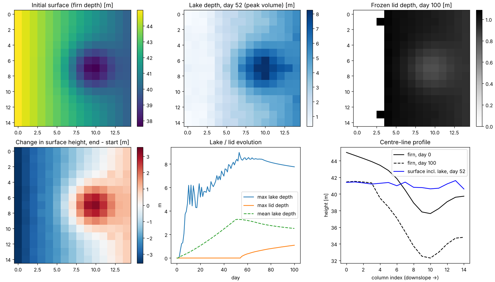
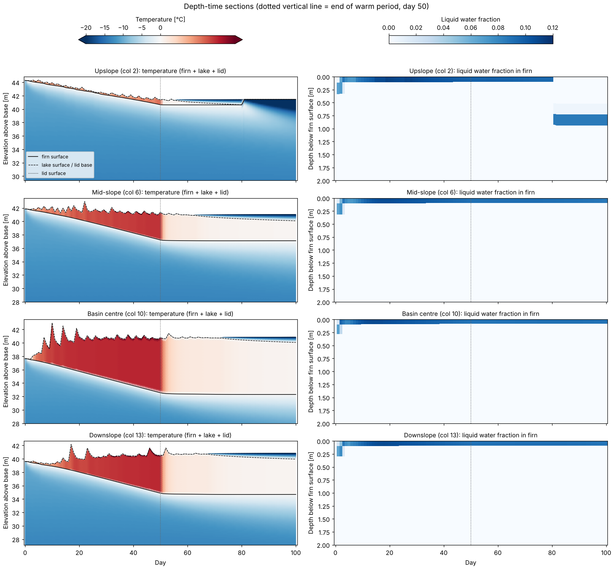
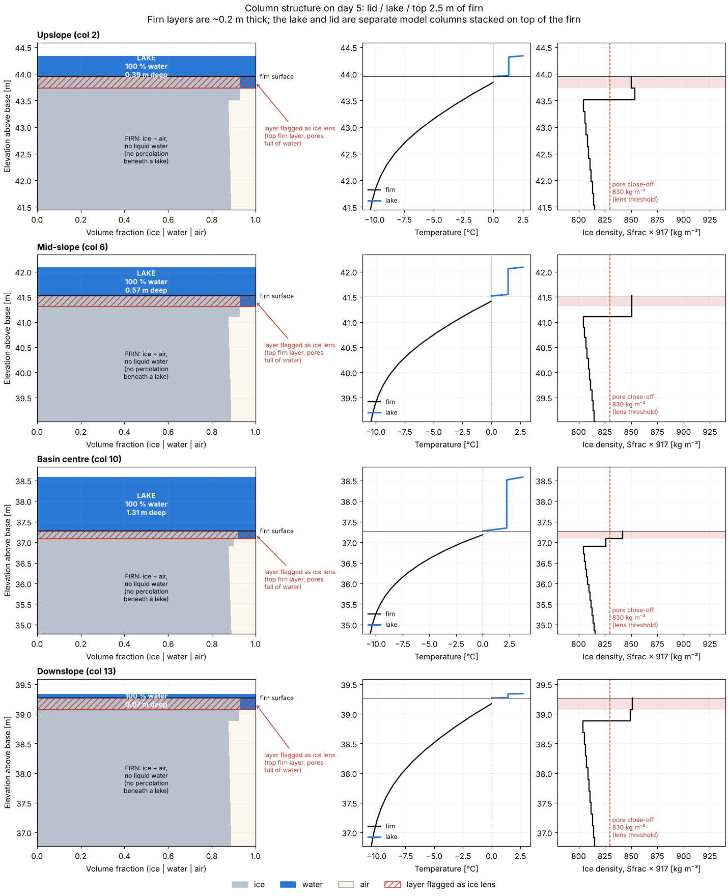

# MONARCHS in an idealized setting

A minimal, self-contained run of [MONARCHS](https://github.com/monarchs-ice/monarchs)
(MOdel of aNtARctic iCe shelf Hydrology and Stability; Buzzard & Elsey) on an
idealized ice-shelf surface. The goal is to test the melt → lateral drainage →
ponding/refreezing process that drives the meltwater mass redistribution this
repo cares about.

## Setup (`model_setup.py`)

- **Grid:** 15 × 15 cells at 1 km, with 200 vertical firn layers.
- **Surface:** a plane sloping 5 m downslope (left → right) with a 4 m deep
  Gaussian basin (σ = 2 km) two-thirds of the way down. MONARCHS uses
  `firn_depth` as surface elevation, so this is the initial firn thickness
  (37.6–45 m).
- **Firn:** the default empirical density profile with `rho_sfc = 800`
  (dense, melt-affected firn, about 2.5 m of pore space). With the default
  `rho_sfc = 500` (about 9 m of pore space), moderate melt soaks into the firn
  and no lakes form within a season.
- **Forcing:** spatially uniform and constant. There are 50 warm days
  (SW 500, LW 350 W m⁻², T 272 K) then 50 cold days (SW/LW 100 W m⁻², T 250 K).
  The MONARCHS example cases use SW = LW = 800 W m⁻², which melts about 15 m
  of firn and floods the whole domain.
- **Boundaries:** closed domain (`catchment_outflow = False`), so no water
  leaves.

## Running

```bash
python -m venv .venv
.venv/bin/pip install "git+https://github.com/monarchs-ice/monarchs.git@7b5e728"
.venv/bin/monarchs -i model_setup.py   # ~3.5 min on 4 cores incl. Numba compile
.venv/bin/python plot_results.py       # -> idealized_results.png
.venv/bin/python plot_profiles.py      # -> profiles_*.png (vertical profiles)
```

Install from GitHub `main` (pinned above), not PyPI. The PyPI release
`monarchs-ice==1.0.3` still imports `NumbaMinpack` in Numba mode, and that
package needs a Fortran compiler. `main` uses a pure-Numba solver instead.
If pip complains that it can't determine the version (the build uses
hatch-vcs), set `SETUPTOOLS_SCM_PRETEND_VERSION=1.0.3.post0`.

Outputs go to `output/` (gitignored): daily 2-D fields in
`idealized_output.nc`, the final model state in `idealized_dump.nc`, and the
met forcing.

## Result



- Ponding starts in the basin within about 5 days. By day 10 the basin lake is
  about 6 m deep, while the mean over the domain is under 0.5 m.
- Water keeps draining downslope and fills the closed lower half of the domain
  to a roughly flat water level (about 41 m). Peak lake volume is on day 52.
- Lakes melt the firn beneath them, so the firn under the basin thins by about
  5 m.
- Once the cold period starts, frozen lids grow to about 1 m by day 100.
- **Net surface-height change:** about −3 m upslope (melt that drained away)
  and up to +3 m in the basin (ponded or refrozen water). This is the
  redistribution that, combined with BFRNs, would change grounding-line flux.

## Vertical profiles

`plot_profiles.py` plots profiles at four points along the centre line (row 7):
upslope (col 2), mid-slope (col 6), basin centre (col 10) and downslope
(col 13). The y-axis is elevation above the column base, so you can see the
firn surface drop and the lake and lid build on top. For this, `model_setup.py`
saves the firn profiles at native resolution (200 layers, about 0.2 m each).
That makes `output/idealized_output.nc` about 190 MB.

- `profiles_full_column.png` / `profiles_near_surface.png`: snapshots on
  days 0, 5, 15, 30, 50, 65, 80 and 100 of temperature (firn + lake + lid),
  bulk density, liquid water fraction and air (pore) fraction.
- `profiles_depth_time.png`: depth–time sections of temperature through
  firn + lake + lid, and of liquid water in the top 2 m of firn.



What the profiles show:

- **The lakes sit on firn that stays dry and unsaturated.** Liquid water stays
  in the top firn layer (about 0.2 m), which holds about 0.1 liquid fraction
  and almost no air. Below it, the air fraction keeps its initial profile
  (about 0.1 near the surface, falling to 0.02 at depth). Densification is off,
  so the firn surface drops because the top of the firn melts, not because it
  compacts. See "Where the water is" below for why the water doesn't go deeper.
- **The lakes are above freezing during the warm period.** The well-mixed lake
  core reaches +3 to +4 °C, with 0 °C at the lake surface and bed. After day
  50 it cools to about +0.3 °C, and a lid grows down from the surface (about
  1 m by day 100).
- **Heat goes down into the firn under lakes.** The lake bed is held at 0 °C,
  and warming spreads about 5–8 m into the firn by day 50. Because the lake
  and lid insulate the firn, that warming keeps spreading downward through the
  cold period.
- **Upslope (col 2) behaves differently.** Its pond is thin (about 0.3 m) and
  freezes through by about day 80. The lid then becomes part of the firn
  column, so the firn surface jumps up by about 0.8 m and the old wet layer is
  buried about 0.8 m down. The newly exposed surface then cools to −40 °C
  under the very low cold-period LW (100 W m⁻²).
- **Caveat:** the buried wet layer upslope stays liquid (fraction about 0.1)
  through day 100, even though the firn around it is below 0 °C. That may be a
  MONARCHS limitation when a lid is converted to firn, and is worth checking
  with the developers.
- **Caveat:** in the first ~30 days, lake levels jump around from day to day.
  This is probably because lateral water moves once per day
  (`lateral_timestep` = 1 day), not a physical signal.

## Where the water is: lake vs. firn

MONARCHS stores each column as three separate parts:

- **Lid:** solid ice. It has only a thickness and a temperature profile.
- **Lake:** liquid water. It has only a thickness and a temperature profile,
  so it is 100 % water by definition. No variable says "water fraction = 1".
- **Firn:** 200 layers, each with an ice fraction (`Sfrac`) and a liquid
  fraction (`Lfrac`). The rest of each layer is air.

So `Lfrac` (the "liquid water fraction" in the plots above) is firn pore water
only. It can never exceed the pore space, which is about 10–13 % here.

`plot_single_time.py <day>` stitches the three parts into one
ice / water / air column at a single time, for the same four locations:



`profiles_day005.png` shows the lakes just after they form, and
`profiles_day030.png` shows them mid-season.

How the lakes form and why the firn under them stays dry, from
`physics/timestep.py` and `physics/firn/percolation.py`:

1. **Before any lake exists:** meltwater percolates and refreezes. Refreezing
   raises the ice density of the top ~0.2–0.4 m from about 805 to about
   850 kg m⁻³.
2. **A lens forms:** once a layer's ice density passes pore close-off
   (`pore_closure = 830`), it is flagged as an impermeable ice lens.
3. **Water ponds:** water fills the pores above the lens up to the surface,
   and the excess becomes lake depth (`exposed_water = True`).
4. **Percolation stops:** from then on, `firn_column` (which includes
   percolation) is no longer called for that cell. The firn under a lake only
   conducts heat, with its top held at 0 °C, and refreezes any liquid it
   already holds. The lake melts the firn top downward, and that meltwater
   goes straight into the lake.

So the firn under a lake stays dry because percolation is switched off once
there is exposed water, not because a lens physically seals it. The lens flag
is "sticky": by day 30 the current top layer (fresh firn exposed by lake-bed
melting) has an ice density of only about 825 kg m⁻³, but `ice_lens_depth`
is still 0.

The choice `rho_sfc = 800` matters here. It starts the surface just below the
830 threshold, so a little refreezing seals it and lakes form within days.
A lower surface density would let more meltwater percolate and refreeze in
the firn before ponding.

## Next steps / caveats

- The forcing is constant and has no diurnal cycle. Realistic forcing (ERA5
  or RACMO) is supported via `met_data`.
- A closed domain forces all melt to stay on the grid. Set
  `catchment_outflow = True` to let water leave at the edges.
- To compare with fill-spill-merge (`../python`), apply the same DEM and melt
  map to both models.
